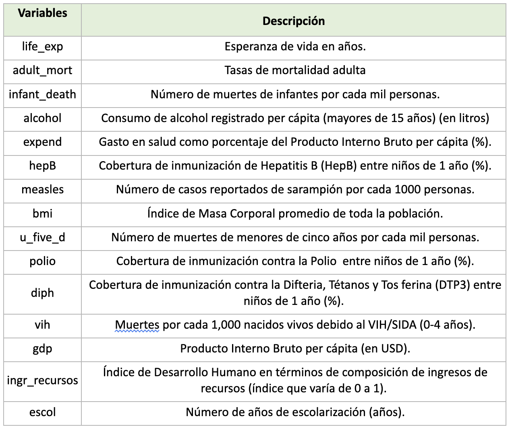
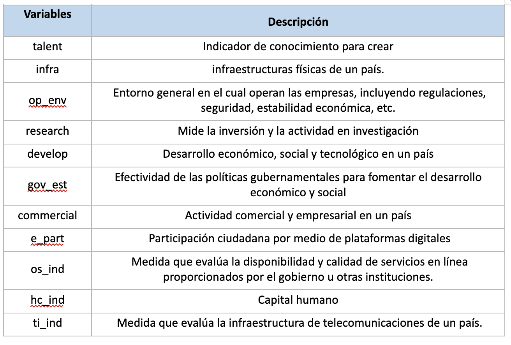

```{r,echo=FALSE, out.width="30%",warning=FALSE,message=FALSE}
knitr::include_graphics("logoPUCP.png") 
```

## FACULTAD DE CIENCIAS SOCIALES - PUCP <br>

### Curso: POL 304 - Estadística para el análisis político 2 \| Semestre 2024 - 2 <br>

### Jefas de Práctica: Karina Alcántara 👩‍🏫 y Lizette Crispín 👩‍🏫<br>

## Bases de datos: 

Todas las bases a usar se encuentran en el siguiente
[link](https://drive.google.com/drive/folders/1J_O3HTU8CzIc6606ZAE8CspBoo6Dd3Y6?usp=sharing).

## Análisis factorial:

#### Caso 1: Exploratorio

Usar base AFE-Caso1.xlsx

```{r,echo=FALSE, out.width="50%",fig.align="center"}
 
```

1.  Presente la Matriz de correlaciones y **comente** los resultados.
    *Hint: las variables son numéricas, no son ordinales*

2.  **Verifique** los prerrequisitos (Factorización y Matriz de
    identidad). **Comente** los resultados.

3.  **Analice** los dos métodos que recomiendan el n° de factores y
    **comente** los resultados  

4.  **Determine** los factores según el número sugerido por los
    autovalues y **solicite** componentes

5.  **Evalúe** el Análisis Factorial Exploratorio solicitado

### Confirmatorio

#### Caso 2: Confirmatorio

Usar base AFC-Caso2.xlsx

```{r,echo=FALSE, out.width="50%",fig.align="center"}
 
```

1.  **Presente** la Matriz de correlaciones. (1pto). *Hint: las
    variables son numéricas, no ordinales.*

2.  **Verifique** los prerrequisitos (Factorización y Matriz de
    identidad). **Comente** los resultados

3.  **Analice** los dos métodos que recomiendan el n° de factores y
    comente los resultados

4.  **Determine** los factores según el número sugerido por los
    autovalues y solicite componentes

5.  **Interprete** diagrama del AFC

#### Caso 3: Ambos

Usar Fact-Caso3.xlsx

```{r,echo=FALSE, out.width="50%",fig.align="center"}
knitr::include_graphics("Diccionario-Fac3.png") 
```

1.  Presente la Matriz de correlaciones en formato **gráfico** y
    **comente** los resultados preliminares.

2.  Verifique los dos prerrequisitos que demuestran que la base de datos
    es adecuada para aplicar la técnica de factoriales. **Comente** los
    resultados.

3.  **Determine** el número de factoriales y **sustente** su elección

4.  **Solicite** el número de factores, **genere** gráfico
    y **comente** el resultado de las cargas factoriales. *Hint: rotate
    = "varimax",fm="minres". Hint :cutoff=0.5.*

5.  A lo largo del análisis Ud cree que puede existir un modelo más
    acertado desde el campo de las ciencias sociales. **Sustente** y
    **solicite** una nueva composición de factores

6.  A partir de su propuesta (anterior pregunta) guarde
    y **estandarice** los componentes en el rango de
    0-100. **Interprete** los resultados de cada factor usando
    estadísticos descriptivos. *Hint: Media, mediana, desviación
    estándard, max y min (usar tidyverse)*

7.  ¿Cuál es la  posición de Perú en **comparación** del resto de países
    en América Latina? Elija **solo un** indicador de los creados
    previamente*.* *Hint: Usar descriptivos LATAM*
