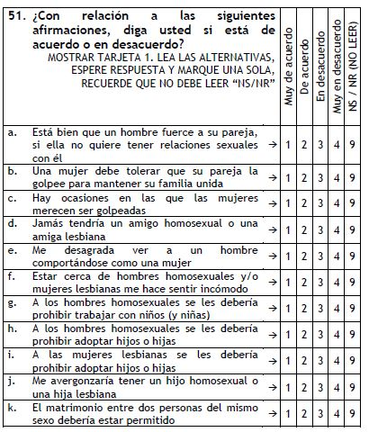

# Pasos previos 

## Cargar las librerias
```{r Carga librerias, message=FALSE, warning=FALSE, paged.print=FALSE}
require(car) #Para recodificar
require(foreign) #Cargar base de datos de otras librerias 
require(ggcorrplot) #Para graficar las correlaciones
require(psych)
```

## Cargar los datos
```{r Cargamos data de dropbox}
genero12 <- read.spss("https://www.dropbox.com/s/kjva39yh3dzb07r/IOP_1212_01_B.sav?dl=1"
                       ,to.data.frame = T, use.value.labels = F)
```

## Procesar los datos 
```{r Subset N°1}
genero12$sex <- factor(genero12$SEXO, labels = c("Hombre", "Mujer"))
genero12$region1 <- factor(genero12$Ambito,labels = c("Lima", "Resto Urbano", "Rural"))
genero12$educ <- genero12$P48
genero12$educ[genero12$educ == 99] <- NA
Subset1 <- genero12[, c(1,108:118)]
NRO <- Subset1[, 1]
df <- Subset1[, 2:12]
df[df==9] <- NA
Subset1 <- cbind(NRO, df)
rm(df, NRO)
```




# Paso 01 Matriz de correlaciones

Se utiliza la función ' "cor" ' para crear la matriz de correlaciones. Esta función toma la lista de variables y compara qué tan similares son entre sí. Puede medir la similitud en función de cómo están distribuidos los valores de las variables mediane el coeficiente de correlación de ' Pearson '. Esta medida cuantifica la relación lineal entre dos variables. 

```{r Creación de la matriz Polychoric}
poly_cor <- polychoric(Subset1[-1])
matri_01 <- poly_cor$rho
matri_01
```

```{r}
ggcorrplot(matri_01,type="lower",hc.order = T)
```

# Paso 02 Prueba de Bartlett 

La prueba de Bartlett sirve para evaluar si hay correlaciones significativas entre las variables en la matriz de correlaciones en comparación con la matriz de identidad. De esta manera se compara que la matriz sea igual a una matriz de identidad (HO) y buscamos que nuestra matriz sea diferente(H1). Por lo que buscamos un p-vlaue menora 0.05.

```{r warning=FALSE}
cortest.bartlett(matri_01)
```

# Paso 03 Prueba de KMO 

El valor de Kaiser-Meyer-Olkin factor adequacy (KMO) obtenido indica la adecuación para realizar análisis factorial. 

Lo que hace es eliminar la influencia o la información que no aporta en la relación con las variables observables, para así ver la correlación real, a este proceso se le denomina correlación parcial.

Lo que buscamos es que cada correlación parcial sea mayor a 0.5.

Los valores de MSA (Medida de Adecuación por Ítem) indican la adecuación individual de cada variable para los análisis mencionados.

```{r}
KMO(matri_01)
```
# Paso 04 Determinar el número de Factores a Extraer

Este grafico se utiliza determinar el número óptimo de factores a extraer de un conjunto de datos. 

En el eje X del gráfico, se muestra el número de factores que se están considerando para el análisis factorial.

En el eje Y del gráfico, se representa la proporción de varianza explicada. Esta proporción indica cuánta varianza de los datos puede ser explicada por los factores extraídos.

El punto en el gráfico donde la línea azul cruza o se aleja significativamente de las barras punteadas indica el número óptimo de factores a extraer. Este punto se considera el punto de inflexión, donde agregar más factores no proporcionaría una mejora sustancial en la varianza explicada.

```{r message=FALSE, warning=FALSE}
fa.parallel(matri_01, fm = "minres", fa="fa", main = "Scree Plot")
```

# Paso 05 Extraemos los facores sin rotar

Standardized loadings (cargas estandarizadas): Representan la relación entre cada variable y cada factor en el análisis factorial. Valores más altos indican una mayor asociación entre la variable y el factor. 

Com: Representa la comunalidad de cada variable,  es una medida de la varianza total de las variables que se explica mediante los factores. Valores más altos indican una mayor proporción de varianza explicada por los factores.

SS loadings: Representa la suma de los cuadrados de las cargas factoriales al cuadrado para cada factor. Indica la cantidad de varianza total explicada por cada factor. 

```{r}
AF1.1<- fa(matri_01, nfactors = 2, rotate = "none", fm="ml")
AF1.2<- fa(matri_01, nfactors = 2, rotate = "none", fm="minres")
AF1.1
AF1.2
```

```{r}
fa.diagram(AF1.1)
fa.diagram(AF1.2)
```

# Paso 06 Extraemos los facores rotados (varimax)

La rotación de los factores es un procedimiento matemático que se aplica para reorganizar y simplificar los factores, de modo que sean más fáciles de entender e interpretar.

La rotación de los factores se basa en las correlaciones entre las variables y busca una configuración en la que las correlaciones sean más claras y tengan una estructura más simple. 

Al aplicar la rotación de los factores, se obtiene una nueva configuración en la que los factores están más separados y se destacan las relaciones más fuertes entre las variables. Esto facilita la interpretación de los factores y permite comprender mejor cómo se agrupan las variables.

```{r}
AF1.3 <- fa(matri_01, nfactors = 2, rotate = "varimax", fm="ml")
AF1.4 <- fa(matri_01, nfactors = 2, rotate = "varimax", fm="minres")
fa.diagram(AF1.3)
fa.diagram(AF1.4)
```

```{r}
print(AF1.3$loadings,cutoff = 0.35)
print(AF1.4$loadings,cutoff = 0.35)
```

# Paso 07 

```{r}
#¿Qué variables aportaron mas a los factores?
sort(AF1.3$communality)
```

```{r}
#¿Qué variables contribuyen a mas de un factor?
sort(AF1.3$complexity)
```

```{r}
#¿Qué variables tiene un componente “único” más grande?
sort(AF1.3$uniquenesses)
```


Notas finales

*Factoring method fm="minres" will do a minimum residual as will fm="uls". Both of these use a first derivative. fm="ols" differs very slightly from "minres" in that it minimizes the entire residual matrix using an OLS procedure but uses the empirical first derivative. This will be slower. fm="wls" will do a weighted least squares (WLS) solution, fm="gls" does a generalized weighted least squares (GLS), fm="pa" will do the principal factor solution, fm="ml" will do a maximum likelihood factor analysis. fm="minchi" will minimize the sample size weighted chi square when treating pairwise correlations with different number of subjects per pair. fm ="minrank" will do a minimum rank factor analysis. "old.min" will do minimal residual the way it was done prior to April, 2017 (see discussion below). fm="alpha" will do alpha factor analysis as described in Kaiser and Coffey (1965) Al respecto vease https://rdrr.io/cran/psych/man/fa.html
