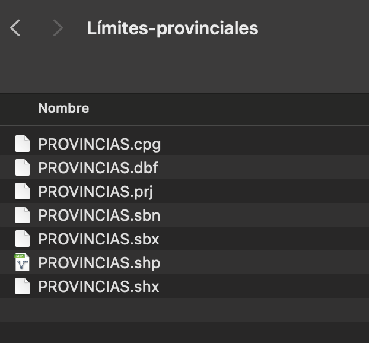

<br>

<center></center>

```{r setup, include=FALSE}
knitr::opts_chunk$set(warning = FALSE, message = FALSE) 
```

```{r,echo=FALSE, out.width="30%",fig.align="left"}
knitr::include_graphics("logoPUCP.png") 
```

**FACULTAD DE CIENCIAS SOCIALES - PUCP** <br>

## Curso: POL 304 - Estadística para el análisis político 2 \| Semestre 2024 - 1

<br>

#### Jefas de Práctica: Karina Alcántara 👩‍🏫 y Lizette Crispín 👩‍🏫<br>

LLamamos a los paquetes necesarios.

```{r}
library(rio)
library(data.table)
library(tidyr)
library(dplyr)
library(tidyverse)
library(sp)
library(polycor)
library(psych)
library(lavaan)
library(semPlot)
library(BBmisc)
library(sf) #Para mapas
library(GPArotation)
```

Esta vez usaremos la data "EgovDemocracia", la cual es un conglomerado
de diversos dataset tales como E-gov index, IDH, democracy index,
digital access index e internet users by country. Estas datas fueron
elegidas debido a la relevancia que han tomado las TIC (tecnologías de
información y comunicación) en el acceso a la información por medios
digitales. Esto, de cara a las ciencias sociales, nos lleva a una
sustancial pregunta: ¿Es el desarrollo de las TICs un factor importante
para el desarrollo de la democracia?

En tanto, para reforzar lo aprendido en la segunda parte del curso,
haremos uso de las técnicas de factorización y cluster para visualizar
los resultados a nivel mundial por medio de la georreferenciación. De
esa manera podremos observar el comportamiento de nuestras variables y
obtener los primeros hallazgos.

# Factores 

```{r}
data <- import("EgovDemocracia.xlsx")
names(data)
data2 <- data[,c(2:13)]
```

Paso 1: Matriz de correlaciones

Generamos la matriz de correlaciones para identificar qué variables de
nuestra subdata están correlacionadas.

```{r}
corMatrix=polycor::hetcor(data2)$correlations
cor.plot(corMatrix,
          numbers=T, #Se muestren los numeros de las correlaciones
          upper=F, #Que aparezca la segunda parte
          main= "Matriz de correlaciones",#Titulo
          show.legend=T)#Mostrar leyenda
```

Paso 2: Corroborar si se puede factorizar

KMO

```{r}
psych::KMO(data2)
```

Bartlett

```{r}
cortest.bartlett(corMatrix,n=nrow(data2))$p.value>0.05 #Menor a 0.05 saldrá FALSE, mayor a 0.05 saldra TRUE
```

Paso 3: Análisis Factorial Exploratorio

Gráfico de sedimentación

```{r}
fa.parallel(corMatrix, fm="pa", fa="fa", main = "Scree Plot")
```

Recomienda 2 factores :)

Autovalores

```{r}
eigenf = eigen(cor(data2, use="complete"))
eigenf$values
```

También recomienda 2 factores :)

Factorizar

```{r}
factorial <- fa(data2,nfactors= 2 ,rotate = "varimax",fm="minres")
factorial
```

```{r}
fa.diagram(factorial)
```

Tenemos una recomendación del modelo exploratorio, corroboremos si ello
va de la mano con el conocimiento de científicos sociales y ajustemos
los factores. ¿Cómo se llamarían los factores?

```{r}
Modelo_confir = "FAC1 =~ InterUsers + telecommunicationInfras + accesoInformacion + onlineService
                FAC2 =~ ProcesoElectoral + FuncionGob + ParticipacionPol+Policulture"
Modelo_confir
```

Lo que se realizaría es indicar el nombre de cada factor, y qué
variables las integran, solo indicamos el nombre de estas variables, en
el siguiente comando indicaríamos la base de datos.

```{r}
modelo=cfa(Modelo_confir, data=data2)
summary(modelo,fit.measures=F)
```

Nos fijamos en la tabla de Latent Variables, y que las variables tengan
un pvalue menor a 0.05 para concluir que si aportan a los factores de
manera significativa.

Graficamos 🤓

```{r}
semPaths(modelo, intercepts = FALSE,edge.label.cex=1.5, optimizeLatRes = TRUE, groups = "lat",pastel = TRUE, exoVar = FALSE, sizeInt=5,edge.color ="black",esize = 6, label.prop=2,sizeLat = 6,"std", layout="circle2")
```

Observemos las "señales gráficas": Vértices, nodos, colores.

Agregamos los factores a la base de datos

```{r}
factorial_casos<-as.data.frame(factorial$scores)
data2$factor1<- factorial_casos$MR1
data2$factor2<- factorial_casos$MR2
data$Egov = normalize(data2$factor1, 
                                        method = "range", 
                                        margin=2, # by column
                                        range = c(0, 10))
data$Demo = normalize(data2$factor2, 
                                        method = "range", 
                                        margin=2, # by column
                                        range = c(0, 10))
```

# Georeferencia  🗺️

## Mapa del mundo

Para poder hacer los mapas necesitas tener descargar los límites de los
países, lo puedes buscar en internet y encontrarás una carpeta. Debes
tener toda la carpeta con todos los archivos dentro con un mismo nombre.

IMPORTANTE: NO BORRAR LOS OTROS ARCHIVOS QUE COMPONEN LA CARPETA.

Como en este ejemplo:

```{r,echo=FALSE, out.width="40%",fig.align="center"}
 
```

```{r}
folder="world_map" #Indicamos el nombre de la carpeta que contiene los límites
file="world_map.shp" #Indicamos el nombre del shapefile (".shp").

mapaFile=file.path(folder,file) #Indicamos la ruta en donde se encuentra el archivo
```

```{r}
worldmap=st_read(mapaFile,stringsAsFactors=FALSE) #Llamamos a los límites
```

Combino mis datas

```{r}
world_map_data=inner_join(worldmap,data,by="NAME") #Agregamos la información de los límites a la data original
```

Heatmap DEMO

```{r}
library(ggplot2)
ggplot(world_map_data)+
  geom_sf(aes(fill=Demo),lwd=0.2)+
   geom_sf_text(aes(label =NAME), size = 2
                ,family="sans",fontface = "bold",check_overlap = TRUE
                )+
  guides(fill=guide_colorbar(title = "Indicador de\ndemocracia")) +
  labs(title = "Nivel de democracia en los países"
      # ,subtitle = "añadir si se desea",
      #caption = "Fuente:añadir si se desea"
      ) +
  scale_fill_gradient(breaks=c(0,5,10),limits= c(0,10), high = "hotpink4", low = "lightpink", guide = "colorbar" ) +
 theme_bw()+
  theme(
    axis.text.x = element_blank(),
    axis.text.y = element_blank(),
    axis.ticks =  element_blank(),
    axis.title = element_blank(),
    panel.border = element_blank(),
    panel.grid.major = element_blank(),
    panel.grid.minor = element_blank()
  
    )+

  theme(
    legend.position=c(0.1, 0.3),
    legend.title = element_text(colour="black", size=10,  face="bold"))
```

Heatmap E-GOV

```{r}
ggplot(world_map_data)+
  geom_sf(aes(fill=Egov),lwd=0.2)+
   geom_sf_text(aes(label = NAME), size = 2
                ,family="sans",fontface = "bold",check_overlap = TRUE
                )+
  guides(fill=guide_colorbar(title = "Indicador de\ngobernanza digital")) + #El "\n" nos permite dar "enter" y saltar de línea para que entre todo el título de la leyenda
  scale_fill_gradient(breaks=c(0,5,10),limits= c(0,10), high = "steelblue", low = "lightcyan", guide = "colorbar") +
 theme_bw()+
  theme(
    axis.text.x = element_blank(),
    axis.text.y = element_blank(),
    axis.ticks =  element_blank(),
    axis.title = element_blank(),
    panel.border = element_blank(),
    panel.grid.major = element_blank(),
    panel.grid.minor = element_blank()
  )+
  theme(
    legend.position=c(0.1, 0.3),
    legend.title = element_text(colour="black", size=10,  face="bold")
      )
```

## Mapa de Perú

```{r}
peru = import("Data-provincias.xlsx")
```

Importo mi shapefile

```{r}
ruta2 <- "Límites-provinciales/PROVINCIAS.shp"
```

```{r}
provincias=st_read(ruta2,stringsAsFactors=FALSE)
```

Creamos código unificador

```{r}
names(provincias)
provincias <- provincias %>%
         mutate(ubigeoProvincia = paste0(CCDD,CCPP,"00"))
```

Combinar bases

```{r}
peru2 <- inner_join(provincias,peru, by = "ubigeoProvincia")
```

```{r}
ggplot(peru2)+
  geom_sf(aes(fill=educacion),lwd=0.2)+
  guides(fill=guide_colorbar(title = "Leyenda")) +
  labs(title = "Mapa de promedio de años de educacion")+
  scale_fill_gradient(breaks=c(3,6,9,12),limits= c(3,12), high = "mediumpurple4", low = "mistyrose1", guide = "colorbar" ) +
 theme_bw()+
  theme(
    axis.text.x = element_blank(),
    axis.text.y = element_blank(),
    axis.ticks =  element_blank(),
    axis.title = element_blank(),
    panel.border = element_blank(),
    panel.grid.major = element_blank(),
    panel.grid.minor = element_blank()
  
    )+

  theme(
    legend.position=c(0.1, 0.3),
    legend.title = element_text(colour="black", size=10,  face="bold"),
    #"left","bottom"
      )
```

```{r}
names(peru2)[11]="Fuerza Popular"
names(peru2)
```

```{r}
peru2 <- peru2 %>%
  mutate(ganopl = ifelse(PL>`Fuerza Popular`,"Gano PL","Perdió PL"))

peru2$ganopl=as.factor(peru2$ganopl)
```

```{r}
ggplot(peru2)+
  geom_sf(aes(fill=ganopl),lwd=0.2)+
  scale_fill_manual(values = c("Gano PL" = "red", "Perdió PL" = "orange"))+
  labs(title = "Mapa Segunda Vuelta")+
 theme_bw()+
  theme(
    axis.text.x = element_blank(),
    axis.text.y = element_blank(),
    axis.ticks =  element_blank(),
    axis.title = element_blank(),
    panel.border = element_blank(),
    panel.grid.major = element_blank(),
    panel.grid.minor = element_blank()
    )+
  guides(fill=guide_legend(title = "Ganador por provincia"))
```
