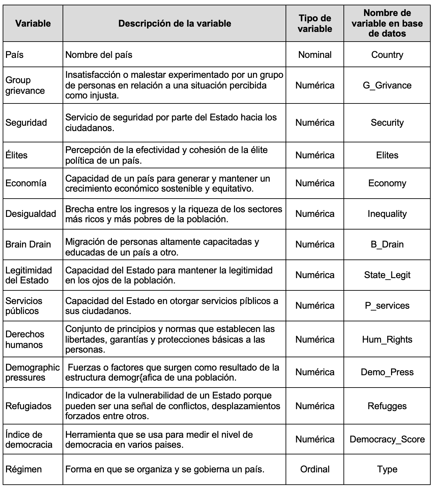
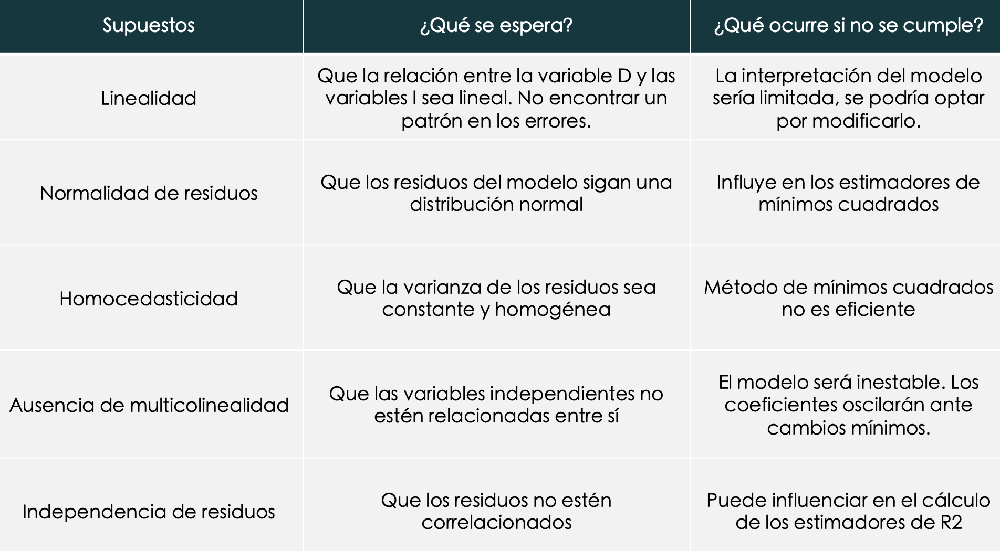
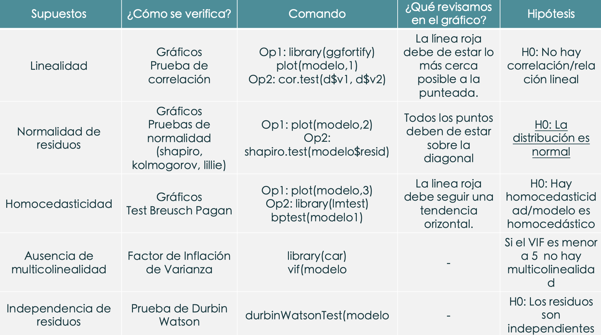

<br>

## FACULTAD DE CIENCIAS SOCIALES - PUCP <br>

### Curso: POL 304 - Estadística para el análisis político 2 \| Semestre 2023 - 2 <br>

Se requiere de su apoyo para poder realizar un análisis sobre las
variables del Índice de Estados Frágiles y su agencia en la democracia
dada una eventual hipótesis la cual supone que efectivamente los
factores que demarcan la fragilidad de un Estado se pueden traducir en
la democracia. Habrá que comprobarlo. En tanto, usted ha sido elegid\@
para un análisis previo mediante la librería de tidyverse para
posteriormente realizar la comparación de dos modelos tentativos para un
artículo de alcance internacional.

*Nota: Las variables del Índice de Estados Frágiles van del 0 al 10,
mayor puntaje hace referencia mayor fragilidad del Estado.*

*Mayor información en: <https://fragilestatesindex.org>*

```{r,warning=FALSE,message=FALSE}
library(rio)
library(dplyr)
library(ggfortify)
library(see)
library(patchwork)
library(performance)
library(nortest)
library(lmtest)
library(car)
```

```{r,echo=FALSE, out.width="70%",fig.align="center",fig.cap = "Diccionario de datos de State_Democracy_final.xlsx"}
 
```

-   Variable dependiente: **Índice de democracia**

Importamos nuestra base de datos:

```{r, fig.show='hide',warning=FALSE,message=FALSE}
library(rio)
data=import("state_democracy_final_23.xlsx")
names(data)
```

# Tidyverse

Filtramos y mostramos los resultados de la variable Type de manera
**descendente**.

```{r, fig.show='hide',warning=FALSE,message=FALSE}
library(tidyverse)
data %>%
  count(Type,sort = T) 
```

#### Democracy_score por tipo de democracia ¿Qué nos dicen los resultados?

```{r,warning=FALSE,message=FALSE}
data%>% 
  group_by(., Type) %>% 
  summarise(mean = mean(Democracy_Score,na.rm=TRUE), n = n()) %>%
  arrange(desc(mean))

```

#### ¿Cuántos países son menor que la media de la variable Inecuality?

```{r,warning=FALSE,message=FALSE}
summary(data$Inequality)
```

```{r}
data%>% 
    filter(Inequality < 5.24) %>% 
    count(.,)
```

```{r}
MenMedia=data%>% 
         filter(Inequality < 5.24)
```

#### A partir de la nueva data frame creada revisemos los casos solo del tipo régimen *autoritario*. ¿Qué nos dice la variable state_legit?

```{r}
MenMedia%>% 
    filter(Type=="Authoritarian regime") %>% 
    summarise(max(State_Legit),
              min(State_Legit),
              mean(State_Legit))
```

-   Inestabilidad para mantener la legitimidad ante la población.

# SUPUESTOS

**Modelo 1:**

**Variable dependiente:**

-   Democracy index

**Variables independientes:**

-   Security
-   State_legit
-   Hum_Rights

```{r}
modelo1=data %>% 
       lm(Democracy_Score ~ Security + State_Legit + Hum_Rights,data=.)

summary(modelo1)
```

-   R-squared
-   P-value: 2.2e-16
-   Ecuación del modelo es y= 9.42953 + 0.14638s -0.47864L -0.38068H.
-   ¿Qué podemos decir de la ecuación?

Recordando los supuestos...

```{r,echo=FALSE, out.width="70%",fig.align="center"}
 
```

```{r,echo=FALSE, out.width="70%",fig.align="center"}
 
```

### **1- Linealidad (el problema es la no linealidad)**

**Descripción** Como su nombre lo dice, debe de existir una linealidad
entre la variable independiente y dependiente, en otras palabras,la
linealidad indica que el valor esperado de la variable dependiente es
una función lineal de cada variable independiente, manteniendo las demás
fijas. La pendiente de esa línea no depende de los valores de las otras
variables, por ello también nos fijamos variable por variable. Los
efectos de diferentes variables independientes sobre el valor esperado
de la variable dependiente son aditivos. Si este supuesto no se cumple
significaría que posiblemente existan variables que no aporten al modelo
o que se trate de una relación no lineal.

**Cómo detectarlo**

OPCIÓN 1: Exploración gráfica: Plot de valores residuales frente a
valores predichos.

**Código e interpretación**

```{r, fig.show='hide',warning=FALSE,message=FALSE}
#Exploración gráfica
plot(modelo1,1)
autoplot(modelo1,1)
```

Usando el código autoplot, la línea azul debería de estar lo más cercana
a la línea punteada horizontal.A partir del grafico podemos observar que
se forma una curva leve; sin emabrgo, se aproximan a la linea del medio.

### **2. Normalidad de residuos (el problema es la NO normalidad)**

**Descripción**

Identificar si los errores siguen una distribución normal. La resta del
valor observado menos el valor pronosticado (residuos) siguen una
distribución normal, esto es importante porque si es que no se cumple no
se podrían aplicar las pruebas globales del modelo.

**Cómo detectarlo**

Exploración gráfica: QQ plot de residuos Pruebas de normalidad a los
residuos. Normalmente bastaría con la prueba de Shapiro Wilk, pero
también se pueden probar otros como Lillieford, Kolmogorov (no es muy
exigente), entre otros.

**Código e interpretación**

Si usamos sólo gráfico

```{r, fig.show='hide',warning=FALSE,message=FALSE}
autoplot(modelo1, 2) 
```

**Si usamos prueba de normalidad:** aplicamos la prueba de Shapiro a los
residuos del modelo si estos son menores a 50 casos y Kolmogorov a aquellos mayores a 50 casos.

```{r,  fig.show='hide',warning=FALSE,message=FALSE}
#shapiro.test(modelo1$resid) #dif por tamaño de muestra
```

```{r}
lillie.test(modelo1$resid) #ES EL CORRECTO PARA EL MODELO1
```

**Ojo con la hipótesis nula**. H0: Es normal (distribución normal) \|
Ha: No es normal (no hay distribución normal)

Si el pvalor es menor a 0.05 entonces *NO existe normalidad de residuos*
(problemas!), se rechazaría la distribución normal.

Al realizar el shapiro test, observamos que el p-values es 0.3886,
mayor a 0.05, por lo que sí existe normalidad de los residuos El modelo
*sí* pasa este supuesto.

### **3- Homocedasticidad (el problema es la heterocedasticidad)**

**Descripción**

La homocedasticidad (también conocido como homogeneidad en la varianza
de los residuos) indica que las variancias de los errores son
constantes. Cuando no se cumple es un problema porque los estimadores no
son consistentes ni eficientes y se presenta el caso de la
heterocedasticidad.

**Cómo detectarlo**

OPCIÓN 1: Exploración gráfica: diagrama de residuos standarizados y
valores predichos.

OPCIÓN 2: Con el Score Test for Non-Constant Error Variance, también
llamado Test Breusch Pagan. Evalúa si la varianza del error cambia con
el nivel de la variable respuesta (valores ajustados) o con una
combinación lineal de predictores.

**Código e interpretación**

Si usamos el gráfico

```{r, fig.show='hide',warning=FALSE,message=FALSE}
autoplot(modelo1, 3)
plot(modelo1, 3)
```

En el Gráfico la línea azul debe seguir una tendencia horizontal, esto
representaría que la distribución de los puntos son uniformes. Al ver
nuestro gráfico nos damos cuenta que la línea azul va hacia abajo, lo
cual nos dice que el gráfico no es concluyente aún. Vamos al test.

Si usamos el test de BP:

```{r message=FALSE, warning=FALSE}
bptest(modelo1)
```

-   H0: El modelo es homocedástico
-   Ha: El modelo es heterocedástico

Si el pvalor es menor a 0.05 entonces el modelo es heterocedástico
(problema! ☠️ ). Esta vez estamos frente a un modelo homocedástico.

-   Se observa que tenemos un p-value de 0.2418. Ya que es mayor a 0.05,
    podemos afirmar que no tenemos problemas de heterocedasticidad, o
    que la varianza de los errores es constante. El modelo pasa este
    supuesto.

### **4. Ausencia de multicolinealidad (el problema es la presencia de multicolinealidad)**

**Descripción**

Se aplica en la regresión lineal MÚLTIPLE. Significa que las variables
explicativas están relacionadas linealmente entre sí. La
multicolinealidad hace que los coeficientes del modelo se vuelvan
inestables, es decir, oscilarán violentamente ante cambios mínimos en
las variables de insumo. Esto entendería que existe una relación fuerte
entre variables independientes, por lo tanto podría darnos un modelo
inestable.

**Cómo detectarlo**

- Con el Factor de Inflación de Varianza (VIF). los factores de inflación
de varianza deben de ser menores de 5. 

-  Mayor a 10, grave problema de multicolinealidad.

**Código e interpretación**

```{r, fig.show='hide',warning=FALSE,message=FALSE}
vif(modelo1)
```

Valores \> 5 indican presencia de multicolinealidad.

### **5.- Independencia de residuos (el problema es que existe autocorrelación en los residuos)**

**Descripción**

Si los errores residuales **no son independientes**, es probable que
demuestren algún tipo de patrón (que no siempre es obvio a simple
vista).

**Cómo detectarlo**

Los puntos se deben acercar lo más posible a la línea oblicua del
gráfico que representa la distribución normal.

**Código e interpretación**

```{r message=FALSE, warning=FALSE}
library(car)
set.seed(11)
durbinWatsonTest(modelo1,simulate = TRUE,reps = 1000)
```

el p-value de durbinWatsonTest es 0.036. **Al ser menor a 0.05, entonces
podemos afirmar que los residuos no son independientes** o que están
autocrrelacionados. El modelo tampoco pasa este supuesto.


## Dinámica grupal

```{r,echo=FALSE, out.width="50%",fig.align="center"}
knitr::include_graphics("PD_revancha_whos.png") 
```
