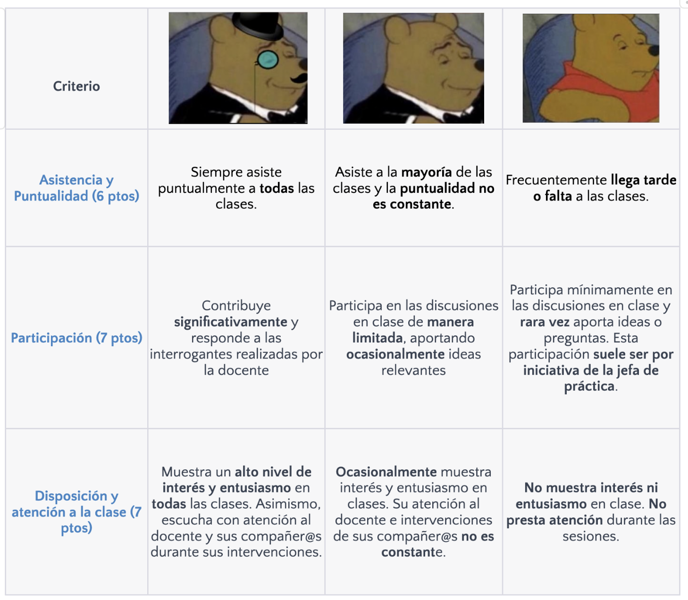

## Sumilla
Se analizan las técnicas cuantitativas de análisis multivariable aplicadas a la investigación en ciencia política. Construcción de modelos cuantitativos para representar relaciones entre fenómenos políticos empíricos. Análisis de la varianza y correlación parcial. Análisis de regresión múltiple: interpretación de coeficientes; regresión con variables categóricas; diagnóstico de regresión; especificación de modelos. Introducción a la regresión logística. Técnicas para identificar categorías de análisis más o menos complejas: análisis discriminante, análisis factorial y análisis de conglomerados.

## Jefas de práctica:

-   Karina Alcántara 👩‍🏫 : k.alcantara\@pucp.pe

-   Lizette Crispín 👩‍🏫: lizette.crispinf\@pucp.edu.pe

-   Profesor del curso : Hans Burkli


## Rúbrica de participación:

```{r,echo=FALSE, out.width="120%",fig.align="center"}

 

```


