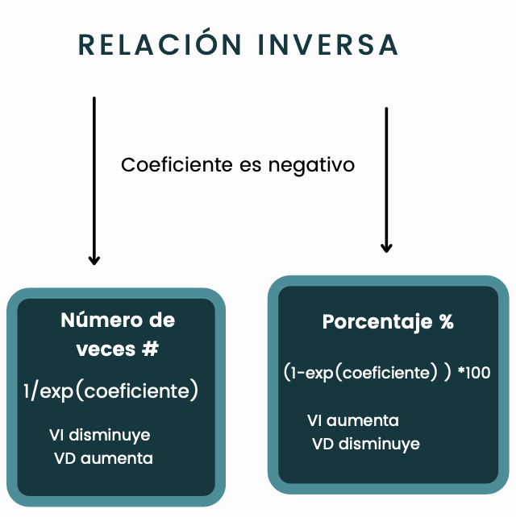

<br>

<center></center>

```{r,echo=FALSE, out.width="30%",fig.align="left"}
knitr::include_graphics("logoPUCP.png") 
```

## FACULTAD DE CIENCIAS SOCIALES - PUCP <br>

### Curso: POL 304 - Estadística para el análisis político 2 \| Semestre 2023 - 2 <br>

### Jefas de Práctica: Karina Alcántara 👩‍🏫 y Lizette Crispín 👩‍🏫<br>

### **SESIÓN 3 - Regresión Logística Binaria** <br>

La base que usaremos hoy es la Encuesta Nacional a Docentes de Instituciones Educativas Públicas de Educación Básica Regular

```{r,echo=FALSE, out.width="30%",fig.align="center"}
 
```

Esta base de datos es del 2020, es decir, que hay que tomar en cuenta que se realizó en contexto de la pandemia. Entonces, hay diversas variables. Con respecto al cuidado de parientes, qué enfermedades ha tenido, satisfacción sobre temas personales o de la misma institución educativa.

```{r, echo = T, results = 'hide',  fig.show='hide'}
library(rio)
endo=import("ENDO1.sav")
```

```{r,  echo = T, results = 'hide',  fig.show='hide',warning=FALSE,message=FALSE}
library(dplyr)
```

Estas son las variables que usaremos:

**Variable dependiente**: *(P2_2)* Retorno a clases

**Variables independientes**:

-   **P1_24_E**: ¿Cuán satisfecho esta Ud. con los siguientes aspectos?: Su empleo en esta IE

-   **P1_2**: EDAD

-   **P1_4**: En su hogar, ¿vive usted con personas de la tercera edad?

-   En su hogar, ¿vive Ud. con personas que están en el grupo de riesgo ante COVID-19 por enfermedades preexistente (P1_5)

Durante el año 2020 
-   ¿sufrió o sufre enfermedades respiratorias?(P1_11_B)

-   ¿sufrió o sufre ansiedad? (P1_11_F)

-   ¿sufrió o sufre depresión (P1_11_G)

-   ¿sufrió o sufre cancer? (P1_11_H)

-   ¿sufrió o sufre COVID-19? (P1_11_L)

-   ¿En este momento se encuentra pagando algún préstamo o crédito? (P1_18)

```{r, echo = T, results = 'hide',  fig.show='hide'}
data =endo%>% 
       select( P2_2, P1_24_E, P1_2, P1_4, P1_5, P1_11_B, P1_11_F, P1_11_G,P1_11_H, P1_11_L, P1_18)
```

Tenemos variable de sexo, edad, si es que es area rural o urbana. También si es que el docente vive con personas de tercera edad, o con personas que tienen factores de riesgo de COVID, si en el 2020 han tenido depresión, ansiedad, enfermedades respiratorias, también hay otra variable sobre si regresarían a a clases de manera presencial etc.

Vamos a realizar diferentes modelos para calentar motores y volvernos unos expertos y expertas en la intrepretación de coeficientes.

Lo que queremos hacer es ver qué factores pueden influenciar en que un docente quiera retornar a clases presenciales

VARIABLE DEPENDIENTE 🤐: Retorno a clases

```{r,  echo = T, fig.show='hide'}
table(data$P2_2)
data$retorno=as.factor(data$P2_2)
levels(data$retorno) = c("No", "Si")
table(data$retorno)
```

Ya teniendo lista la variable depediente vamos a realizar unos cuantos modelos y analizar el odds y la probabilidad.

# MODELO 1:

VD: Retorno VI: El docente vive con personas de la tercera edad

```{r}
data$P1_4=ifelse(data$P1_4 == "1", "1","0")
data$P1_4=as.numeric(data$P1_4) #numérica 
table(data$P1_4)
```

Creemos nuestro modelo (función glm) Recuerda que lo que se está modelando es el logaritmo del odds (p/1-p).

```{r}
modelo1 = glm(retorno ~ P1_4,family= binomial ,data)
summary(modelo1)
```

Ahora vamos a calcular los coeficientes del modelo [*los coefficientes obtenidos en esta regresión logística son el logaritmo natural de odds*] [*La función exponencial es la inversa del logaritmo*]

Veamos

Revisemos los coeficientes.

```{r}
coef(modelo1)
```

Recuerda que es importante revisar el signo del coeficiente, ya que dependiendo de eso procederemos a interpretar. En este caso, el coeficiente es negativo; es decir, la relación es inversa.

```{r,echo=FALSE, out.width="30%",fig.align="center"}
 
```

[Cuando calculcamos el exponencial de los coeficientes, obtenemos el odds ratio (\# de veces de que ocurra)].Sin embargo, como el coeficiente es negativo esa exponencial debe dividir al 1 (1/exp(log)).

```{r}
1/exp(coef(modelo1)) 
```

Siempre que la relación es inversa, la interpretación es cuando la VI disminuye, la VD aumenta en xx veces. En este caso, 1.47 veces.

Tenemos dos maneras de poner analizar este resultado Recordemos que la VI era si el o la docente vive con personas de la tercera edad.

-   Si el o la docente vive con personas de la tercera edad, el odds de que quiera retornar a clases presenciales disminuye en 1.47

-   Otra manera analizarlo como una probablilidad, para ello es necesario realizar el siguiente cálculo (**1- exp(coef))\*100**

Recuerda que el coeficiente de la VI es *-0.3860* es el

```{r}
(1-exp(-0.3860))*100
```

En este caso podemos interpretar los resultados como "si el docente vive con una persona de la tercera edad, la probabilidad de que quiera retornar a clases presenciales DISMINUYE en un 32.03%.

# MODELO 2

#### REALICEMOS UN SEGUNDO MODELO

Agreguemos más variables:

-   vive con personas de la tercera edad (P1_4)

-   ¿sufrió o sufre cancer? (P1_11_H)

-   ¿sufrió o sufre depresion? (P1_11_G)

Queremos saber si estas variables influyen en la probabilidad de que el docente quiera retornar o no a clases presenciales

```{r}
modelo2 = glm(retorno ~ P1_4+P1_11_H+P1_11_G, family = binomial,data = data)
summary(modelo2)
```

```{r}
coef(modelo2)
```

### Ojo, los tres coeficientes son negativos. Calculemos el exponencial

Para calcular el odds ratio.

```{r}
exp(coef(modelo2)) 
```

Nuevamente, el odds ratio es menor que 1.

Como son menores que 1 entonces lo restamos y explicamos los resultados en base a la disminución de veces.

```{r}
1/(exp(-0.38429))
1/(exp(-0.92276))
1/(exp(-0.26229))
```

Análisis según n° de veces

-   Si el docente vive con personas de la tercera edad el odds/probabilidad de que quiera retornar a clases presenciales disminuye en 1.46 veces

-   Si el docente ha tenido o tiene cáncer el odds/probabilidad de que quiera retornar a clases presenciales disminuye en 2.51 veces

-   Si el docente ha tenido o tiene depresión el odds/probabilidad de que quiera retornar a clases presenciales disminuye en 1.29 veces

Ahora analicemos las probabilidades:

```{r}
#Cuando el odds es menor a 1
(1-(exp(-0.38429)))*100
(1-(exp(-0.92276)))*100 
(1-(exp(-0.26229)))*100 
```

-   Si el docente vive con personas de la tercera edad, la probabilidad de que quiera retornar a clases presenciales disminuye en 31%

-   Si el docente ha tenido o tiene cáncer la probabilidad de que quiera retornar a clases presenciales disminuye en 60%

-   Si el docente ha tenido o tiene depresión la probabilidad de que quiera retornar a clases presenciales disminuye en 23%

#### Si queremos calcular datos determinados

Ejemplo 1: Si el docente no vive con personas de la tercera edad, tiene cancer y tiene depresión

```{r}
log.odds1 = predict(modelo2, data.frame(P1_4 = 0, P1_11_H = 1, P1_11_G = 1))
log.odds1
exp(log.odds1)/(1+exp(log.odds1))
```

La probabilidad de que quiera retornara a clases presenciales es de 0.80

Ejemplo 2: Si el docente no vive con personas de la tercera edad, no tiene cancer y tiene depresión

```{r}
log.odds1 = predict(modelo2, data.frame(P1_4 = 0, P1_11_H = 0, P1_11_G = 1))
exp(log.odds1)/(1+exp(log.odds1)) #lo pasamos a probabilidades
```

La probabilidad de que quiera retornara a clases presenciales es de 0.91

## 🙌 Ayuda divina 🙌

Les proponemos esta función (Agradezcanle a su profesor) que facilita la interpretación de los resultados. La función se llama Divine.Help, para poder usarla solo necesitas indicar como argumento al nombre de tu modelo: Divine.Help(modelo). Recuerda que esta función solo podrá ejecutarse si previamente has ejecutado el código que crea la función.

```{r}
Divine.Help <- function(model) {
   # Extraer los coeficientes del modelo
  coeficients <- coef(model)[-1] # Excluye el intercepto
   # Inicializar un vector para almacenar los efectos
  effects <- numeric(length(coeficients))
  
  for (i in 1:length(coeficients)) {
    if (coeficients[i] < 1) {
      effects[i] <- round(1 - exp(coeficients[i]), 2)
    } else {
      effects[i] <- round(exp(coeficients[i] - 1), 2)
    }
  }
  
   # Generar la interpretación en lenguaje natural
  interpretation <- paste0("Un aumento de una unidad en la variable ", names(coeficients),
                           " está asociado con un cambio de ",
                           abs(effects)*100, "% en la probabilidad de éxito.")
   # Devolver los coeficientes, efectos y la interpretación en un dataframe
  result <- data.frame(Coefficient = coeficients,
                       Exp = exp(coeficients),
                       Probability = effects,
                       Interpretation = interpretation)
   return(result)
}

Divine.Help(modelo2)
```

# MODELO 3:

Nuestras explicativas serán si la persona vive o no con personas de la tercera edad, tiene o ha tenido ansiedad y la variable edad.

```{r}
modelo3 = glm(retorno ~ P1_4+P1_11_F+P1_2, family = binomial, data = data)
summary(modelo3)
```

Recuerda revisar los signos, para poder identificar el tipo de relación.

```{r}
coef(modelo3)
```

Interpretemos según n° de veces

```{r}
1/(exp(-0.35441669))
1/(exp(-0.43774133))
1/(exp(-0.01928669 ))
```

Análisis

-   Si el docente vive con personas de la tercera edad el odds de que quiera retornar a clases presenciales disminuye en 1.42 veces

-   Si el docente ha tenido o tiene ansiedad el odds de que quiera retornar a clases presenciales disminuye en 1.54 veces

-   Si el docente aumenta en un 1 su edad el odds de que quiera retornar a clases presenciales disminuye en 1.01 veces

#### Ahora en porcentaje (probabilidad)

```{r}
(1-(exp(-0.35441669))) *100
(1-(exp(-0.43774133)))*100 
(1-(exp(-0.01928669 )))*100 
```

-   Si el docente vive con personas de la tercera edad la probabilidad de que quiera retornar a clases presenciales disminuye en 29%

-   Si el docente ha tenido o tiene ansiedad la probabilidad de que quiera retornar a clases presenciales disminuye en 35.5%

-   Si el docente aumenta en 1 su edad la probabilidad de que quiera retornar a clases presenciales disminuye en 1.9%

Ahora obtengamos la probabilidad según casos

```{r}
log.odds3 = predict(modelo3, data.frame(P1_4 = 0, P1_11_F = 1, P1_2 = 50))
exp(log.odds3)/(1+exp(log.odds3))#para pasarlo a probabilidad
```

Cuando un o una docente vive con personas de tercera edad, tiene ansiedad y tenga 50 años, la probabilidad de que quiera retornar a clases presenciales es de 0.89.

Ahora obtengamos la probabilidad con menor edad.

```{r}
log.odds3 = predict(modelo3, data.frame(P1_4 = 0, P1_11_F = 1, P1_2 = 25))
exp(log.odds3)/(1+exp(log.odds3))
```

Cuando un o una docente vive con personas de tercera edad, tiene ansiedad y tenga 25 años, la probabilidad de que quiera retornar a clases presenciales es de 0.93.


