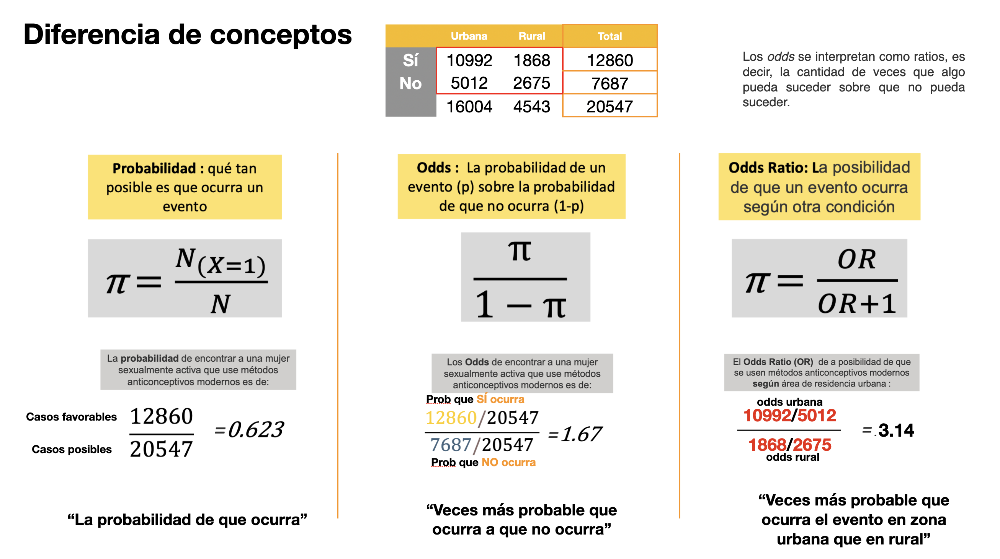
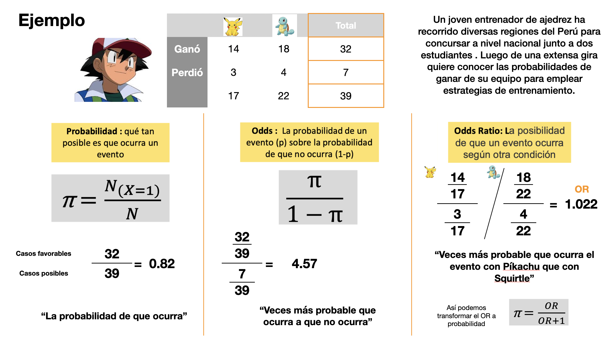
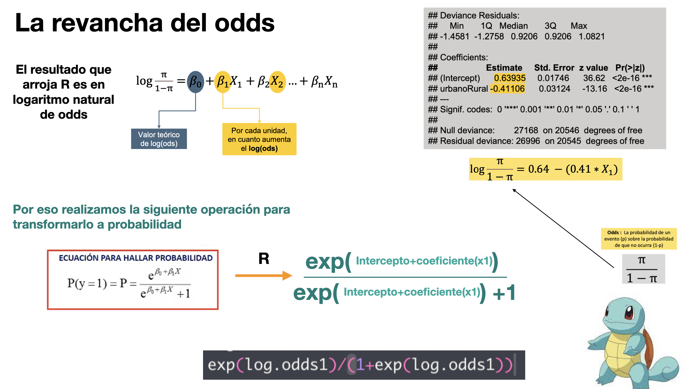

<br>

<center></center>

```{r,echo=FALSE, out.width="30%",fig.align="left"}
knitr::include_graphics("logoPUCP.png") 
```

## **FACULTAD DE CIENCIAS SOCIALES - PUCP** <br>

### Curso: POL 304 - Estadística para el análisis político 2 \| Semestre 2024- 1

<br>

#### Jefas de Práctica: Karina Alcántara 👩‍🏫 y Lizette Crispín 👩‍🏫<br>

<br>

### **SESIÓN 3 - Regresión Logística Binaria** <br>


<br> <br> <br>

```{r,echo=FALSE, out.width="100%",fig.align="center"}
 
```

<br> <br> <br>

```{r,echo=FALSE, out.width="100%",fig.align="center"}
 
```

<br> <br> <br>

```{r,echo=FALSE, out.width="100%",fig.align="center"}
knitr::include_graphics("PD3_ejemplo2.png") 
```

<br> <br> <br>

```{r,echo=FALSE, out.width="100%",fig.align="center"}
 
```

<br> <br> <br>

# Modelo logístico binario


```{=html}
<style>
.custom-text {
  color: #00688B;
  font-family: Helvetica, sans-serif;
  text-align: center;
  font-weight: bold;
  font-size: 22px;
}
</style>
```
::: custom-text
¿Qué factores pueden influenciar el que un docente quiera retornar a clases presenciales? 🤔
:::


La base que usaremos hoy es la Encuesta Nacional a Docentes de Instituciones Educativas Públicas de Educación Básica Regular

```{r,echo=FALSE, out.width="30%",fig.align="center"}
knitr::include_graphics("endo.png") 
```

Esta base de datos es del 2020, es decir, que hay que tomar en cuenta que se realizó en contexto de la pandemia. Entonces, hay diversas variables. Con respecto al cuidado de parientes, qué enfermedades ha tenido, satisfacción sobre temas personales o de la misma institución educativa.

```{r, echo = T, results = 'hide',  fig.show='hide',message=FALSE,warning=FALSE}
library(rio)
library(dplyr)
library(marginaleffects)
endo=import("ENDO1.sav")
```

Estas son las variables que usaremos:

**Variable dependiente**: *(P2_2)* Retorno a clases

**Variables independientes**:

-   **P1_24_E**: ¿Cuán satisfecho esta Ud. con los siguientes aspectos?: Su empleo en esta IE

-   **P1_2**: EDAD

-   **P1_4**: En su hogar, ¿vive usted con personas de la tercera edad?

-   **P1_5**: En su hogar, ¿vive Ud. con personas que están en el grupo de riesgo ante COVID-19 por enfermedades preexistente

<br>

Durante el año 2020

-   **P1_11_B**: ¿sufrió o sufre enfermedades respiratorias?

-   **P1_11_F**: ¿sufrió o sufre ansiedad?

-   **P1_11_G**: ¿sufrió o sufre depresión

-   **P1_11_H**: ¿sufrió o sufre cancer?

-   **P1_11_L**: ¿sufrió o sufre COVID-19?

-   **P1_18**: ¿En este momento se encuentra pagando algún préstamo o crédito?

## Limpieza de data

Selección de variables a usar

```{r, echo = T}
data =endo%>% 
       select( P2_2, P1_24_E, P1_2, P1_4, P1_5, P1_11_B, P1_11_F, P1_11_G,P1_11_H, P1_11_L, P1_18)
```

Tenemos variable de sexo, edad, si es que es area rural o urbana. También si es que el docente vive con personas de tercera edad, o con personas que tienen factores de riesgo de COVID, si en el 2020 han tenido depresión, ansiedad, enfermedades respiratorias, también hay otra variable sobre si regresarían a clases de manera presencial.

```{r,results = 'hide'}
names(data)
```

Cambiamos los nombres para que sea más fácil identificar las variables

```{r}
colnames(data)=c("Retorno" ,  "satIE","edad"  ,  "terEd" ,   "riesCov",  "resp","anx", "dep", "cancer", "cov","cred")
```

```{r}
data=as.data.frame(data[complete.cases(data),])
```

**VARIABLE DEPENDIENTE: `Retorno`**

```{r,  echo = T, fig.show='hide'}
table(data$Retorno)
data$Retorno=as.factor(data$Retorno)
levels(data$Retorno) = c("No", "Si")
table(data$Retorno) #confirmo el nuevo formato de la variable
```

Ya teniendo lista la variable depediente vamos a realizar unos cuantos modelos y analizar el odds y la probabilidad.

# MODELO 1 : Retorno y personas de la tercera edad

-   VD: Retorno (variable dicotómica)
-   VI: El docente vive con personas de la tercera edad terEd

```{r}
data$terEd=ifelse(data$terEd == "1", "1","0") 
data$terEd=as.numeric(data$terEd)  
table(data$terEd)
```

Creemos nuestro modelo (función glm). Recuerda que lo que se está modelando es el `logaritmo del odds (p/1-p)`.

```{r}
modelo1 = glm(Retorno ~ terEd,family= binomial,data)
summary(modelo1)
```

Recordemos que

-   *Los coefficientes obtenidos en esta regresión logística son el logaritmo natural de odds*

Es importante revisar el **signo** del coeficiente, ya que dependiendo de eso procederemos a interpretar. En este caso, el coeficiente es negativo; es decir, *la relación es inversa.* La interpretación de la probabilidad tendrá la siguiente forma:

> "cuando la VI aumenta o es 1 (para dicotómicas), la probabilidad de que la VD sea 1 (sea del caso de éxito) en promedio disminuye en [resultado de avg_slopes]..."

[**Ejemplo** para VI numérica (edad)]{.smallcaps}

-   [Cuando la edad **aumenta** en 1 año, la probabilidad de que la persona quiera emigrar a Europa **disminuye** en 20.5%.]{.smallcaps}

[Ejemplo para VI dicotómica:]{.smallcaps}

-   [Cuando la persona **sí** tiene hijos **(es 1)** , la probabilidad de que la persona quiera emigrar a Europa disminuye en 31.3%]{.smallcaps}

Ahora en el modelo1:

```{r}
avg_slopes(modelo1)[,c(1,3)]

```

Identificamos que la variación en la probabilidad es de -0.0309; es decir, disminuye un 3.09%. Esto quiere decir que cuando una persona sí vive con personas de tercera edad (es 1), la probabilidad de que quiera retornar a clases disminuye en un 0.0309 o en 3.09% (en promedio).

¿De donde sale este valor? 😼

```{r, eval = T}
head(modelo1$fitted.values,10)
```

Solo existen dos posibles probabilidades: cuando no tiene personas de tercera edad, 0.926, y cuando sí tiene personas de tercera edad, 0.895. Entonces la reducción de la probabilidad será la diferencia entre ambos.

```{r}
0.9266417 - 0.8957288

```

# MODELO 2 : Retorno, personas de la tercera edad y enfermedades

Agreguemos más variables:

-   vive con personas de la tercera edad **(terEd)**

-   ¿sufrió o sufre cancer? **(cancer)**

-   ¿sufrió o sufre depresion? **(dep)**

Queremos saber si estas variables influyen en la probabilidad de que el docente quiera retornar o no a clases presenciales

```{r}
modelo2 = glm(Retorno ~ terEd+cancer+dep, family = binomial(link=logit),data = data)
summary(modelo2)
```

Ojo, los tres coeficientes son negativos. Calculemos la probabilidad de que los docentes quieran retornar a las clases presenciales.

```{r}
avg_slopes(modelo2)[,c(1,3)]
```

Interpretemos **(Ojo: las variables aparecen en orden alfabético)**

-   Si el docente ha tenido o tiene cáncer, la probabilidad de que quiera retornar a clases presenciales disminuye, en promedio, en 0.1038 o en 10.38%

-   Si el docente ha tenido o tiene depresión, la probabilidad de que quiera retornar a clases presenciales disminuye, en promedio, en 0.0221 o en 2.21%

-   Si el docente vive con personas de la tercera edad, la probabilidad de que quiera retornar a clases presenciales disminuye, en promedio, en 0.0307 o en 3.07%

#### Si queremos calcular datos determinados

Ejemplo 1: Si el docente no vive con personas de la tercera edad, tiene cancer y tiene depresión

```{r}
log.odds1 = predict(modelo2, data.frame(terEd = 0, cancer = 1, dep = 1))

exp(log.odds1)/(1+exp(log.odds1))#lo pasamos a probabilidades
```

La **probabilidad** estimada de que quiera retornara a clases presenciales es de 0.80

Ejemplo 2: Si el docente **no** vive con personas de la tercera edad, no tiene cancer y tiene depresión

```{r}
log.odds2 = predict(modelo2, data.frame(terEd = 0, cancer = 0, dep = 1))
exp(log.odds2)/(1+exp(log.odds2)) #lo pasamos a probabilidades
```

La probabilidad de que quiera retornara a clases presenciales es de 0.91

# MODELO 3: Retorno, personas de la tercera edad, ansiedad, edad

Nuestras explicativas serán si la persona vive o no con personas de la tercera edad, tiene o ha tenido ansiedad y la variable edad.

```{r}
modelo3 = glm(Retorno ~ terEd+anx+edad, family = binomial, data = data)
summary(modelo3)
```

Analicemos las probabilidades con los efectos marginales:

```{r}
avg_slopes(modelo3)
```

Interpretemos:

-   Si el docente ha tenido o tiene ansiedad la probabilidad de que quiera retornar a clases presenciales disminuye en 0.0367 o en 3.67%

-   Si el docente aumenta en 1 año su edad la probabilidad de que quiera retornar a clases presenciales disminuye en 0.0015 o en 0.15%

-   Si el docente vive con personas de la tercera edad la probabilidad de que quiera retornar a clases presenciales disminuye en 0.0282 o en 2.82%

Ahora obtengamos la probabilidad de que quieran retornar a clases presenciales según ciertas condiciones:

¿Qué sucede cuando el docente NO vive con personas de tercera edad (es 0), ha tenido o tiene ansiedad (es 1) y su edad es de 50 años?

```{r}
log.odds3 = predict(modelo3, data.frame(terEd = 0, anx = 1, edad = 50))
exp(log.odds3)/(1+exp(log.odds3)) #para pasarlo a probabilidad
```

Cuando un o una docente vive con personas de tercera edad, tiene ansiedad y tenga 50 años, la probabilidad de que quiera retornar a clases presenciales es de 0.89 o de 89.34%.

Ahora obtengamos la probabilidad con menos edad.

```{r}
log.odds4 = predict(modelo3, data.frame(terEd = 0, anx = 1, edad = 25))
exp(log.odds4)/(1+exp(log.odds4))
```

Cuando un o una docente vive con personas de tercera edad, tiene ansiedad y tenga 25 años, la probabilidad de que quiera retornar a clases presenciales es de 0.93 o de 93.27%
