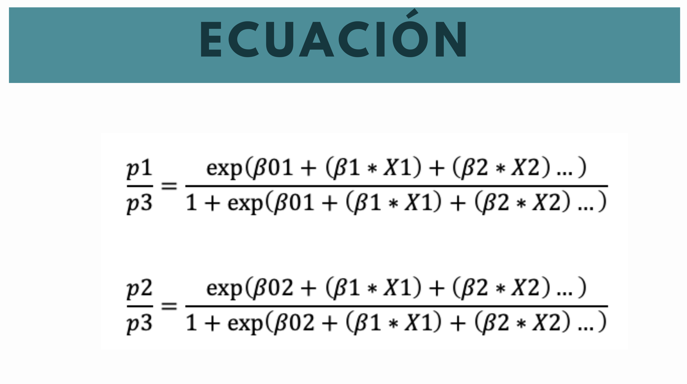
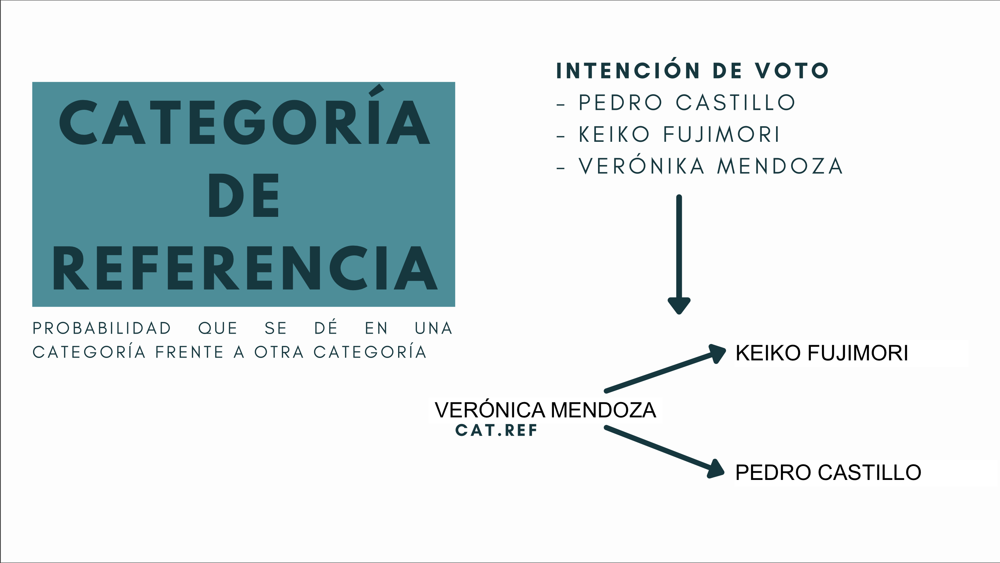
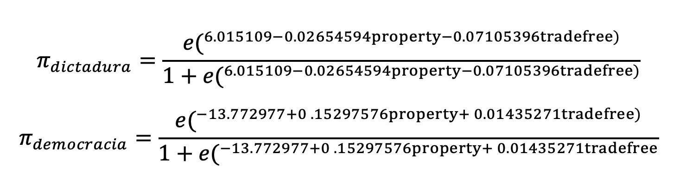
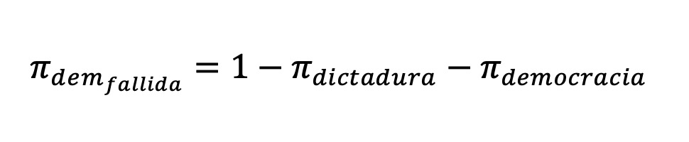

<br>

<center></center>

```{r,echo=FALSE, out.width="30%",fig.align="left"}
knitr::include_graphics("logoPUCP.png") 
```

## **FACULTAD DE CIENCIAS SOCIALES - PUCP** <br>

### Curso: POL 304 - Estadística para el análisis político 2 \| Semestre 2023 - 2

<br>

#### Jefas de Práctica: Karina Alcántara 👩‍🏫 y Lizette Crispín 👩‍🏫<br>

<br> <br>

```{r,echo=FALSE, out.width="100%",fig.align="center"}
knitr::include_graphics("PD4_GLM.png") 
```

<br>

```{r,echo=FALSE, out.width="100%",fig.align="center"}
 
```

<br>

```{r,echo=FALSE, out.width="100%",fig.align="center"}
 
```

## Base de Datos

La base de datos a trabajar combina los datos obtenidos en el Democracy
Index (<https://en.wikipedia.org/wiki/Democracy_Index>) y el Index of
Economic Freedom
(<https://en.wikipedia.org/wiki/Index_of_Economic_Freedom>). Lo que
veremos en esta clase es la relación entre el tipo de régimen político
(democracia, democracia fallida y dictadura) con algunas variables
económicas.

Todo esto para comprobar el supuesto: *¿una economía liberal influye en
el nivel de democracia?*

Llamemos a las librerías

```{r,warning=FALSE,message=FALSE, results = 'hide'}
library(rio)
library(car)
library(nnet)
library(DescTools)
library(RVAideMemoire)
library(marginaleffects)
```

Exploremos la data:

```{r}
demofree <- import("https://github.com/schrodingercase/primary/raw/master/demofree.xlsx")
str(demofree) #Ver estructura de la base de datos
```

# Pregunta de investigación

**¿Existe alguna relación entre el tipo de régimen político y las
variables "Trade freedom" sistema económico con mayor libertad de
comercio y "Property Rights" Derecho a la propiedad privada?**

-   VD= Regimen Político

-   VI= Trade Freedom (Libertad de comercio) y Property Rights (Derecho
    a la propiedad privada)

# Modelo 1

## Paso 1: Preparar la data

### 1.1. Limpieza de data e identificación de las variables

```{r}
demofree$regimen <- demofree$`Regime type`
demofree$property <- demofree$`Property Rights`
demofree$tradefree <- demofree$`Trade Freedom`
```

Eliminamos casos perdidos

```{r}
demofree <- demofree[complete.cases(demofree$regimen),]
```

<br>

Comencemos con la variable dependiente:

```{r}
table(demofree$regimen)
```

Ojo, con Hybrid regime y Flawed democracy

```{r}
demofree$regimen <- recode(demofree$regimen, "'Full democracy' = 3; 'Hybrid regime' = 2; 'Flawed democracy' = 2; 'Authoritarian' = 1")
table(demofree$regimen)
```

Volvemos factor la variable para poder etiquetarla nuevamente

```{r}
demofree$regimen <- as.factor(demofree$regimen)
levels(demofree$regimen) <- c("Dictadura","Democracia fallida","Democracia")
```

```{r}
table(demofree$regimen)
```

```{r}
demofree$property <- as.numeric(demofree$property)
demofree$tradefree <- as.numeric(demofree$tradefree)
```

### 1.2. Elegir la línea base

La línea de base o baseline sirve para tener una referencia al
interpretar los resultados del modelo. En este caso nuestra dependiente
fue recodificada en "Democracia","Democracia fallida","Dictadura".
Entonces, "Democracia fallida" al estar en el medio es nuestra baseline.

Verificamos qué ha considerado R

```{r}
contrasts(demofree$regimen)
```

Con el siguiente comando establecemos la categoría de referencia. en
*ref* mencionamos cómo se llama esta categoría, por eso es importante
tener bien etiquetadas las variables.

```{r}
demofree$regimen <- relevel(demofree$regimen , ref = "Democracia fallida")
```

## Paso 2: Modelo logístico

### 2.1 Realizar modelo logístico

No olvidemos cual es nuesta línea de base para la interpretación.

```{r}
mod1 <- multinom(regimen ~ property + tradefree, data = demofree)
summary(mod1)
```

### 2.2: Relación de las variables

Un primer paso sería ver el signo de los coeficientes para determinar la
relación entre la variable independiente y la variable dependiente

**Derechos de propiedad**

-   Coeficiente (dictadura) :-0.02654594

Si un país aumenta en un punto el indicador de derechos a la propiedad,
la probabilidad de que sea dictadura a que sea democracia fallidad
disminuye

-   Coeficiente (democracia): 0.15297576

Si un país aumenta en un punto el indicador de derechos a la propiedad,
la probabilidad de que sea democracia a que sea democracia fallida
aumenta

**Libertad económica**

-   Coeficiente(dictadura) :-0.07105396

Si un país aumenta en un punto indicador de libre comercio, la
probabilidad de que sea dictadura a que sea democracia fallida
disminuye.

-   Coeficiente(democracia):0.01435271

Si un país aumenta en un punto el indicador de libre comercio, la
probabilidad de que sea democracia a que sea democracia fallida aumenta

### 2.3: Significancia de las variables

Se debe realizar variable por variable

```{r}
#install.packages("RVAideMemoire")
test.multinom(mod1,property) # Se coloca test.multinom(nombredelmodelo,variableindependiente1)
```

Para la variable property, de la dos comparaciones con nuestra categoría
de referencia, la única significativa es cuando se compara democracia
con democracia fallida.

```{r}
test.multinom(mod1,tradefree)
# Se coloca test.multinom(nombredelmodelo,variableindependiente2)
```

Para la variable tradefree, de la dos comparaciones con nuestra
categoría de referencia, la única significativa es cuando se compara
dictadura con democracia fallida.

## Paso 3: Interpretación de coeficientes con efectos marginales

Con los efectos marginales podemos medir la probabilidad de que ocurra
cada escenario (democracia, democracia fallida o dictadura). Para la
interpretación usamos el estimado.

```{r}
Marg1=marginaleffects(mod1,type = "probs")
summary(Marg1)[c(1,2,4)]   
```

-   Cuando en un país el índice de derecho a la propiedad incrementa un
    punto, la probabilidad de que este país presente una democracia
    aumenta en promedio 0.00958.

-   Cuando en un país el índice de libertad de comercio incrementa un
    punto, la probabilidad de que este país presente una democracia
    aumenta en promedio 0.00141.

-   Cuando en un país el índice de derecho a la propiedad incrementa un
    punto, la probabilidad de que este país presente una democracia
    fallida disminuye en promedio 0.00423.

-   Cuando en un país el índice de derecho a la propiedad incrementa un
    punto, la probabilidad de que este país presente una democracia
    fallida aumenta en promedio 0.00998

## Paso 4: Recordando la ecuación

```{r,echo=FALSE, out.width="80%",fig.align="center"}
 
```

Usemos los siguientes valores:

-   Property = 50

-   Tradefree= 60

Probabilidad de que sea **dictadura**

```{r}
Num1<-exp(6.118423-0.02654594*50-0.07105396*60)
Deno1<-1+Num1
ProbDictadura<-Num1/Deno1
ProbDictadura
```

Si un país tiene 50 de indice de derecho a la propiedad y 60 de indice
de libertad de comercio, tiene un 0.62 de probabilidad de ser una
dictadura.

Probabilidad de que sea **democracia**

```{r}
Num2 <- exp(-13.772977+0.15297576*50+0.01435271*60)
Deno2<-1+Num2
ProbDemo<-Num2/Deno2
ProbDemo
```

Si un país tiene 50 de indice de derecho a la propiedad y 60 de indice
de libertad de comercio, tiene un 0.005 de probabilidad de ser una
democracia

¿Cuál es la probabilidad de que sea una **democracia fallida**?

```{r,echo=FALSE, out.width="80%",fig.align="center"}
 
```

```{r}
1-ProbDictadura-ProbDemo
```

Si un país tiene 50 de indice de derecho a la propiedad y 60 de indice
de libertad de comercio, tiene un 0.366 de probabilidad de ser una
democracia fallida

# Modelo 2

¿Qué sucede si añadimos a nuestras variables independientes una
categórica?

```{r,echo=FALSE, out.width="20%",fig.align="center"}
knitr::include_graphics("tehc.png") 
```

La libertad comercial (Business Freedom) es muchas veces reconocida como
una variable indispensable en toda democracia. ¿Cuánto afectaría al
modelo? Vamos a crear un modelo agregando esta variable al modelo

## Paso 1: Preparación de data

Cambiamos el nombre de la variable

```{r}
demofree$busfree <- demofree$`Business Freedom`
```

La volvemos numérica porque también es un indicador numérico, pero la
volveremos dummy para así poder analizarla como categórica.

```{r}
demofree$busfree <- as.numeric(demofree$busfree)
summary(demofree$busfree)
```

Para fines prácticos, dividamos esta variable en países con poca
libertad comercial y con mucha libertad comercial.

Libertad comercial: Poca Libertad comercial Mucha

```{r}
demofree$busfreef <- ifelse(demofree$busfree<=74.50, "Poca", "Mucha")
table(demofree$busfreef)
```

#### Volvemos "Dummy"

Utilizamos el paquete fastDummies para dicotomizar las variables, en
select_columns indicamos qué variable queremos dicotomizar

```{r}
library(fastDummies)
demofree <- dummy_cols(demofree, select_columns = c("busfreef"))
```

```{r}
names(demofree)
```

```{r}
table(demofree$busfreef_Poca)
```

```{r}
table(demofree$busfreef_Mucha)
```

## Paso 2: Modelo logístico

```{r}
mod2<- multinom(regimen ~ property + tradefree + busfreef_Poca, data = demofree)
summary(mod2)
```

### 2.2. Relación de las variables

#### **Derechos de propiedad**

-   Coeficiente (dictadura) :-0.03774142

Si un país aumenta en un punto el indicador de derechos a la propiedad,
la probabilidad de que sea dictadura a que sea democracia fallidad
disminuye

-   Coeficiente (democracia): 0.14741855

Si un país aumenta en un punto el indicador de derechos a la propiedad,
la probabilidad de que sea democracia a que sea democracia fallida
aumenta

#### **Libertad económica**

-   Coeficiente(dictadura) :-0.07454554

Si un país aumenta en un punto indicador de libre comercio, la
probabilidad de que sea dictadura a que sea democracia fallida disminuye

-   Coeficiente(democracia):0.01448272

Si un país aumenta en un punto el indicador de libre comercio, la
probabilidad de que sea democracia a que sea democracia fallida aumenta

#### **Poca libertad de comercio**

-   Coeficiente(busfreef_Poca): -1.0531380

Cuando un país sí tiene poca libertad de comercio (es 1), la
probabilidad de que sea dictadura a que sea democracia fallida
disminuye.

-   Coeficiente(busfreef_Poca): -0.2906452

Cuando un país sí tiene poca libertad de comercio (es 1), la
probabilidad de que sea democracia a que sea democracia fallida
disminuye.

### 2.1: Significancia de las variables

```{r}
test.multinom(mod2,property) # Se colocar test.multinom(nombredelmodelo,variableindependiente1)
```

```{r}
test.multinom(mod2,tradefree)
# Se coloca test.multinom(nombredelmodelo,variableindependiente2)
```

## Paso 3: Interpretación de coeficientes con efectos marginales

```{r}
Marg2<-marginaleffects(mod2,type = "probs")
summary(Marg2)[c(1,2,4)]   
```

## Paso 4: Recordamos la ecuación

Usemos los siguientes valores:

-   Property = 50

-   Tradefree= 60

-   Busfreef= 1

Probabilidad de que sea dictadura

```{r}
Num1<-exp(7.719501-0.037741424*50-0.07454554*60-1.0531380*1)
Deno1<-1+Num1
ProbDictadura<-Num1/Deno1
ProbDictadura
```

Probabilidad de que sea democracia

```{r}
Num2<- exp(-13.207954+0.14741855*50+0.01448272*60-0.2906452*1)
Deno2<-1+Num2
ProbDemo<-Num2/Deno2
ProbDemo
```

Probabilidad de que sea democracia fallida

```{r}
1-ProbDictadura-ProbDemo
```

# COMPARAR MODELOS

### AIC

Debemos elegir el que arroje un menor valor. Ojo! Solo se usa para
comparar modelos.

```{r}
AIC(mod1) #GANADOR
AIC(mod2)
```

¿Predice bien mi modelo? Revisemos qué tan bien estarían categorizados
mis países según mi modelo 1.

```{r}
table(demofree$regimen)
table(demofree$regimen,predict(mod1))
```

Vemos que ha categorizado a la mayoría de países bien por cada
categorías.

Esto también podemos verlo en porcentaje

```{r}
prop.table(table(demofree$regimen,predict(mod1)),1)
```

### PSEUDO R CUADRADO

```{r,warning=FALSE}
PseudoR2(mod1, which = c("Nagelkerke"))
PseudoR2(mod2, which = c("Nagelkerke"))
```

Según el Pseudo R2, los modelos tienen un nivel de ajuste muy parecido.
