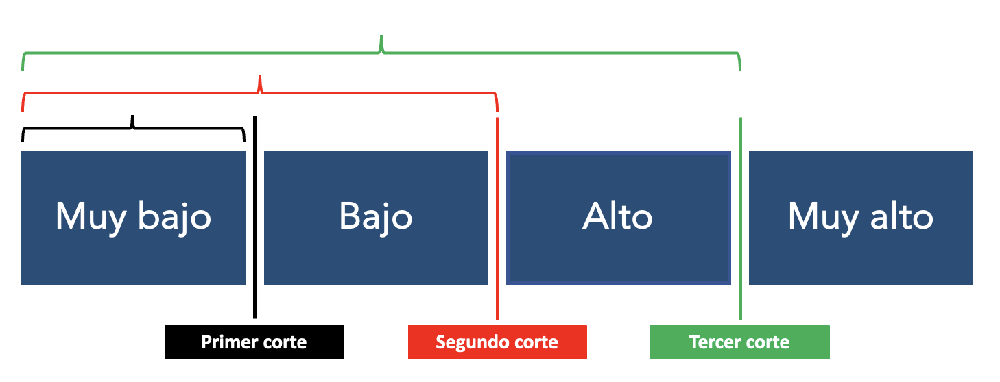
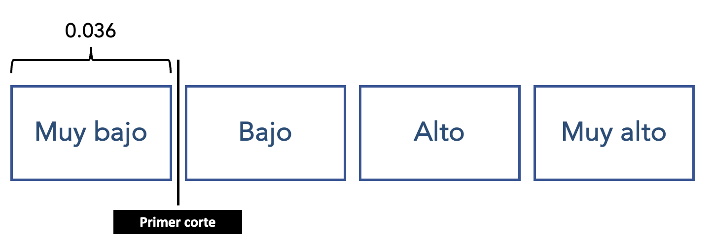
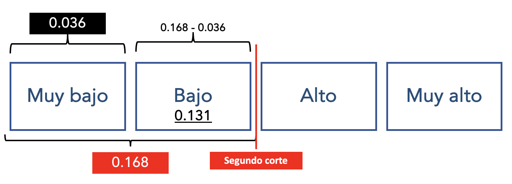
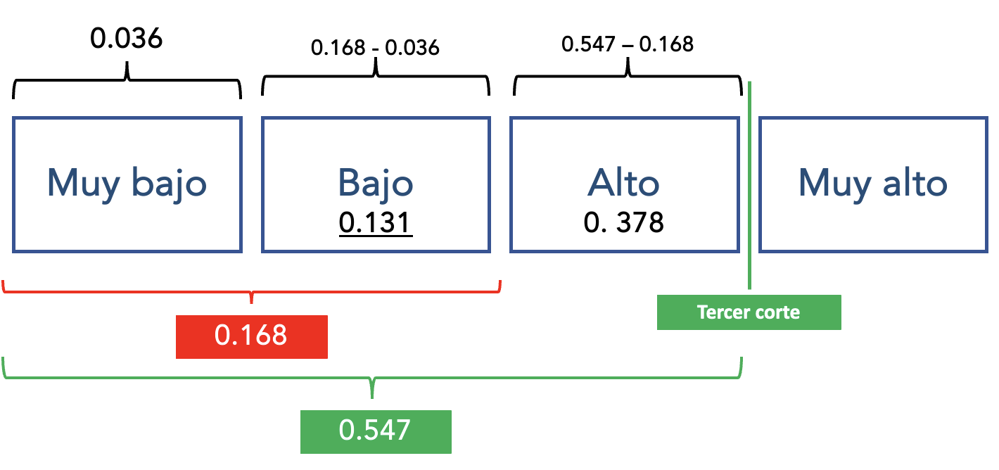
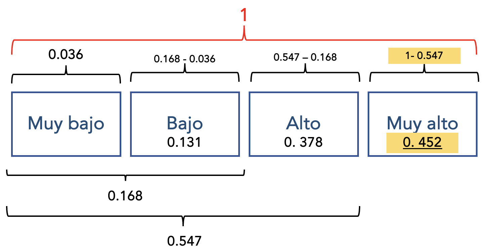

<br>

<center></center>

```{r,echo=FALSE, out.width="30%",fig.align="left"}
 
```

## **FACULTAD DE CIENCIAS SOCIALES - PUCP** <br>

### Curso: POL 304 - Estadística para el análisis político 2 \| Semestre 2024 - 1

<br>

#### Jefas de Práctica: Karina Alcántara 👩‍🏫 y Lizette Crispín 👩‍🏫<br>

<br> <br>

Llamemos a los paquetes

```{r,warning=FALSE, message=FALSE}
library(rio) #para importar la base
library(fastDummies) #Para volver dummy a una variable categórica
library(MASS) #para crear el modelo
library(marginaleffects) #para calcular la probabilidad
library(DescTools) #Para calcular el pseudo R2
library(dplyr)

```

```{r, message=FALSE, warning=FALSE}
data <- import("trabajadores.sav")
```

**Pregunta de investigación: ¿De qué manera, el sexo y los años de
educación condicionan el nivel de salario que puede tener un
trabajador?**

<br> <br>

# **Paso 1: Preparar la data**

### Variable dependiente: Salario anual (nivel)

Está como un número, identificamos los cuartiles para poder realizar 3
cortes y crear cuatro categorías.

```{r}
summary(data$salario_actual)
hist(data$salario_actual)
```

Inidcamos los puntos de corte, guiándonos de los cuartiles, el resultado
nos dará un factor ordenado.

```{r}
data$salario_actual_ordinal <- cut(data$salario_actual, breaks = c(0, 24000,28875, 36938,135000),
                                  include.lowest = T, ordered_result = T,
                                  labels = c("Muy Bajo", "Bajo",
                                        "Alto", "Muy Alto"))

table(data$salario_actual_ordinal)
```

### Variables independientes: sexo y educación

-   Sexo: identifiquemos como está y de ser necesario recategoricemos y
    agreguemos etiquetas.

```{r}
class(data$sexo)
table(data$sexo)
```

```{r}
data <- data %>% 
  mutate(sexo = factor(sexo, levels = 0:1, labels = c("Mujer", "Hombre")))
table(data$sexo)
```

Convertimos a dummy a la variable sexo

```{r, message=FALSE, warning=FALSE}
data<-dummy_cols(data, select_columns = c("sexo"))
```

-   Educación: Identifiquemos como está

```{r}
str(data$educ)
```

Volvemos Dummy la variable *Sexo*

```{r, message=FALSE, warning=FALSE}
data<-dummy_cols(data, select_columns = c("sexo"))
```

Revisamos que se hayan añadido nuestras variables correctamente.

```{r}
names(data)
```

Veamos si el nivel educativo, y el ser mujer influye en el salario
actual

# **Paso 2: Creación del modelo**

```{r, message=FALSE, warning=FALSE}
modelo <- polr(salario_actual_ordinal ~ sexo_Mujer + educ, data = data, Hess=T)
summary(modelo)

```

### Veamos el p-value y determinar la significancia de las variables independientes

Guardamos la tabla de coeficientes en un objeto.

```{r}
summary_table <- coef(summary(modelo)) #OBTENER TABLA CON COEFICIENTES
summary_table
```

Calculamos el pvalue a partir de t value y lo almacenamos en otro
objeto.

```{r}
pval <- pnorm(abs(summary_table[, "t value"]),lower.tail = FALSE)* 2
pval
```

Agregamos este nuevo objeto (vector) a la tabla de coeficientes.

```{r}
summary_table <- cbind(summary_table, "p value" = pval)
summary_table
```

Esta tabla nos da un resumen de los coeficientes y el pvalue.

-   H0: La variable independiente no aporta al modelo

Lo que buscamos entonces es ver *si el p-value es menor a 0.05* en las
variables independientes seleccionadas.

# **Paso 3: Interpretamos el efecto de las variables**

```{r}
marg<-avg_slopes(modelo,type="probs")
summary(marg)[c(1,2,4)]  
```

Recuerda que si la relación es positiva aumenta en 1 o es 1 (si es
dicotómica), la probabilidad aumenta; pero si es negativa si aumenta en
1 o es 1, la probabilidad disminuye.

-   Cuando los años de educación aumentan en una unidad, la probabilidad
    de que tenga un salario alto aumenta en 1.03%. 

-   Cuando la persona es mujer (cuando sexo_Mujer es 1), la probabilidad
    de que tenga un salario alto disminuye en 9.54%

-   Y así para la demás variables....

# **Paso 4: Preparamos la ecuación del modelo**

Hagamos un ejemplo, queremos hallar la probabilidad de cada uno de los
cortes y categorías para el caso de que la persona sea hombre y tenga 15
años de educación.

### ¿Cuál es la probabilidad de tener un salario alto para un *hombre (sexo_Mujer = 0) con 15 años de educación*?

Recordamos los coeficientes

```{r}
coef(summary(modelo))
```

```{r,echo=FALSE, out.width="80%",fig.align="center"}
 
```

## **PRIMER CORTE: Muy Bajo \| Bajo**

Hallemos primero la probabilidad del primer corte, que era Muy Bajo -
Bajo. Es decir, que la persona sea hombre con 15 años de educación tenga
un salario que sea menor o igual a muy bajo.

Reemplazamos los números de los coeficientes del corte de las variables
independientes.

```{r}
num_1 <- exp(3.6632 - ((-1.8363*0) + (0.4618*15)))
denom_1 <- 1 + num_1
p_menorigual_muybajo<- num_1/denom_1
p_menorigual_muybajo

```

La probabilidad de que una persona que sea hombre y con 15 años de
educación tenga un salario menor o igual a Muy Bajo (solo muy bajo) es
de 0.036 o de 3.6%

```{r,echo=FALSE, out.width="80%",fig.align="center"}
 
```

## **SEGUNDO CORTE: Bajo \| Alto**

Ahora calculemos para todo lo que está por debajo de alto (menor o igual
a bajo); es decir, muy bajo y bajo.

```{r}
num_2 <- exp(5.3306 - ((-1.8363*0) + (0.4618*15)))
denom_2 <- (1 + num_2)
p_menorigual_bajo<-num_2/denom_2
p_menorigual_bajo
```

La probabilidad de que una persona que sea hombre y con 15 años de
educación tenga un salario menor o igual a bajo es de 0.16 o 16%

#### SOLO PROBABILIDAD DE BAJO

Se tiene la probabilidad de ser bajo y muy bajo, y previamente se hizo
la de muy muy bajo, estos se restan vas a tener la probabilidad de ser
únicamente bajo

```{r}
p_menorigual_bajo-p_menorigual_muybajo
```

La probabilidad de que una persona que sea hombre y con 15 años de
educación tenga un salario Alto es de 0.13 o de 13.1%

```{r,echo=FALSE, out.width="80%",fig.align="center"}
 
```

## **TERCER CORTE: Alto - Muy alto**

En este corte se calculan los tres escalones menores o iguales a alto:
Muy bajo, bajo y alto.

```{r}
num_3 <-exp(7.1165 - ((-1.8363*0) + (0.4618*15)))
denom_3 <- (1 + num_3)
p_menorigual_alto<-num_3/denom_3
p_menorigual_alto
```

La probabilidad de que una persona que sea hombre y con 15 años de
educación tenga un salario menor o igual a Alto - Bajo es de 0.54 o de
54%.

#### SOLO PROBABILIDAD DE ALTO

A la probabilidad de tener un nivel salarial menor o igual a alto
(resultado de tercer corte), le restamos la probabilidad de tener un
salario de nivel bajo, muy bajo (resultado de segundo corte).

```{r}
p_menorigual_alto - p_menorigual_bajo
```

La probabilidad de que una persona que sea hombre y con 15 años de
educación tenga un salario Alto es de 0.378 o de 37.8%

```{r,echo=FALSE, out.width="80%",fig.align="center"}
 
```

#### SOLO PROBABILIDAD DE MUY ALTO

Como recordamos que era una probabilidad acumulada, donde llegaba hast
MUY ALTO era 1. Ya tenemos la probabilidad de tener salario alto o
menos, para hallar la probabilidad de que sea muy alto, solo debemos
restar el resultado del tercer corte a 1 (1- Tercer corte)

```{r}
1-p_menorigual_alto
```

Entonces, la probabilidad de que una persona que sea hombre y con 15
años de educación tenga un salario Muy Alto es de 45.2%

```{r,echo=FALSE, out.width="80%",fig.align="center"}
 
```

# **Paso 5: ¿Cuánto explica nuestro modelo?**

```{r}
PseudoR2(modelo, which = c("Nagelkerke"))
```
